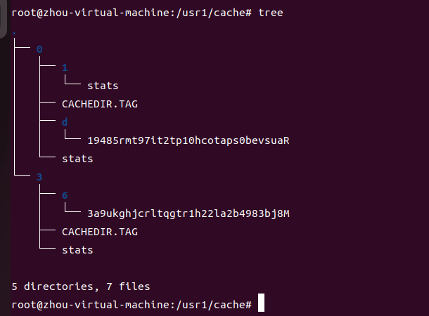

书接上回
之前有简单介绍ccache的基本概念、安装、使用。

现在进行更详细的ccache详解。

# §前言
在上一篇中，大致介绍了下ccache的缓存原理。


> ccache将本次编译命令的产物，复制并压缩一份到缓存目录中，下次编译的时候， 如果检测到相同编译命令，并且没有修改输入的源文件（当前c/cpp或依赖的头文件） ，则直接读取缓存目录中上次编译流程，省去编译时间，从而优化编译时长。

通过 ccache 作为编译器，执行的编译命令到底会发生什么？
让我们开启ccache的Debug， 通过debug 日志来了解 ccache的执行过程~
# §开启Ccache Debug
当前笔者环境上的为 ccache 4.6.1版本的，后续内容都将以这个版本进行分析
[ccache V4.6.1](https://github.com/ccache/ccache/releases/tag/v4.6.1)

```shell
    export CCACHE_DEBUG=1  // 在命令行中export 此环境变量，即可获取ccache的执行日志
    make                   // 再进行编译， 本次操作删除了清空了缓存目录，为首次编译
```

可以看到除了目标文件hello.o之外，还剩了三个ccache相关的日志

- *.ccache-input-c
- *.ccache-input-d
- *.ccache-input-text
- *.ccache-log

目前我们仅需查看 cacche-log即可里面记载了ccache的执行日志，其他三个文件为计算hash内容debug 日志，在后续中再进行介绍。
## 探索ccache的debug 日志
查看hello.o.ccache-log
除去上面大量的初始化配置日志，比较关键的日志如下**
``` shell
[2022-12-17T00:37:41.934881 19021] Command line: ccache g++ -c hello.cpp -o hello.o   # 当前的编译命令
[2022-12-17T00:37:41.934912 19021] Hostname: zhou-virtual-machine                     # 当前的user
[2022-12-17T00:37:41.934916 19021] Working directory: /usr1/zhou/code                 # 当前cwd
[2022-12-17T00:37:41.935236 19021] Compiler type: gcc                                 # 编译类型
[2022-12-17T00:37:41.935308 19021] Source file: hello.cpp                             # 编译源文件
[2022-12-17T00:37:41.935313 19021] Object file: hello.o                               # 目标文件
[2022-12-17T00:37:41.935678 19021] Trying direct lookup                               # 尝试直连命中
[2022-12-17T00:37:41.936101 19021] No 363a9ukghjcrltqgtr1h22la2b4983bj8 in primary storage  
                        # 直连命中 Manifest文件： 363a9ukghjcrltqgtr1h22la2b4983bj8 在primary strage(主仓) 失败
[2022-12-17T00:37:41.936432 19021] Running preprocessor                              # 开启预处理
[2022-12-17T00:37:41.936446 19021] Executing /usr/bin/g++ -E hello.cpp               # 子进程执行预处理
[2022-12-17T00:37:42.052209 19021] Got result key from preprocessor                  # 预处理成功
[2022-12-17T00:37:42.052252 19021] No 0d19485rmt97it2tp10hcotaps0bevsua in primary storage
                      #  查询 Result 文件：0d19485rmt97it2tp10hcotaps0bevsua 在primary strage(主仓) 失败
[2022-12-17T00:37:42.052261 19021] Running real compiler                            # 进行原始编译
[2022-12-17T00:37:42.052312 19021] Executing /usr/bin/g++ -c -fdiagnostics-color -o hello.o hello.cpp
[2022-12-17T00:37:42.496329 19021] Using default compression level 1                # 使用zstd level为1进行压缩Result文件
[2022-12-17T00:37:42.497015 19021] Storing embedded entry #0 .o (3504 bytes) from hello.o
[2022-12-17T00:37:42.498304 19021] Stored 0d19485rmt97it2tp10hcotaps0bevsua in primary storage (/usr1/cache/0/d/19485rmt97it2tp10hcotaps0bevsuaR)                                                   # 存储Result文件到缓存目录
[2022-12-17T00:37:42.498434 19021] Adding result key to /usr1/cache/3/6/3a9ukghjcrltqgtr1h22la2b4983bj8M
                                                                                    # 将Result文件记录到Manifest文件
[2022-12-17T00:37:42.499175 19021] Using default compression level 1                # 压缩Manifest文件
[2022-12-17T00:37:42.500370 19021] Stored 363a9ukghjcrltqgtr1h22la2b4983bj8 in primary storage (/usr1/cache/3/6/3a9ukghjcrltqgtr1h22la2b4983bj8M)                                                   # 将Manifest文件存储到缓存目录
[2022-12-17T00:37:42.500448 19021] Result: cache_miss                               # 本次编译记录为miss
[2022-12-17T00:37:42.500453 19021] Result: direct_cache_miss
[2022-12-17T00:37:42.500455 19021] Result: preprocessed_cache_miss
[2022-12-17T00:37:42.500457 19021] Result: primary_storage_miss
[2022-12-17T00:37:42.500501 19021] Acquired lock /usr1/cache/3/stats.lock
[2022-12-17T00:37:42.500668 19021] Releasing lock /usr1/cache/3/stats.lock
[2022-12-17T00:37:42.500688 19021] Unlink /usr1/cache/3/stats.lock
[2022-12-17T00:37:42.515 19021] Acquired lock /usr1/cache/0/stats.lock
[2022-12-17T00:37:42.500785 19021] Releasing lock /usr1/cache/0/stats.lock
[2022-12-17T00:37:42.500798 19021] Unlink /usr1/cache/0/stats.lock


```

虽然注释了，但很多概念还是不能理解，直连命中是什么？ Manifest 文件是什么？ 为什么要预处理？ Resul文件又是什么？

先对比二次编译命中场景下的日志有什么区别，后续再来解释这些问题。

```shell
[2022-12-17T19:00:29.335864 19969] Command line: ccache g++ -c hello.cpp -o hello.o
[2022-12-17T19:00:29.335886 19969] Hostname: zhou-virtual-machine
[2022-12-17T19:00:29.335889 19969] Working directory: /usr1/zhou/code
[2022-12-17T19:00:29.335894 19969] Compiler type: gcc
[2022-12-17T19:00:29.335961 19969] Source file: hello.cpp
[2022-12-17T19:00:29.335965 19969] Object file: hello.o
[2022-12-17T19:00:29.336299 19969] Trying direct lookup
[2022-12-17T19:00:29.336351 19969] Retrieved 363a9ukghjcrltqgtr1h22la2b4983bj8 from primary storage (/usr1/cache/3/6/3a9ukghjcrltqgtr1h22la2b4983bj8M)                             
                                                 # 从缓存目录中找到了Manifest文件 363a9ukghjcrltqgtr1h22la2b4983bj8
[2022-12-17T19:00:29.336365 19969] Looking for result key in /usr1/cache/3/6/3a9ukghjcrltqgtr1h22la2b4983bj8M
[2022-12-17T19:00:29.374338 19969] Got result key from manifest    
                                                 # 从Manifest文件中找到了 Result文件 0d19485rmt97it2tp10hcotaps0bevsua
[2022-12-17T19:00:29.374368 19969] Retrieved 0d19485rmt97it2tp10hcotaps0bevsua from primary storage (/usr1/cache/0/d/19485rmt97it2tp10hcotaps0bevsuaR)
[2022-12-17T19:00:29.374514 19969] Reading embedded entry #0 .o (3504 bytes)
[2022-12-17T19:00:29.374523 19969] Writing to hello.o
[2022-12-17T19:00:29.374572 19969] Succeeded getting cached result
[2022-12-17T19:00:29.374593 19969] Result: direct_cache_hit                         # 统计为直连命中
[2022-12-17T19:00:29.374596 19969] Result: primary_storage_hit
[2022-12-17T19:00:29.374648 19969] lockfile_acquire: symlink /usr1/cache/0/1/stats.lock: No such file or directory
[2022-12-17T19:00:29.374705 19969] Acquired lock /usr1/cache/0/1/stats.lock
[2022-12-17T19:00:29.374918 19969] Releasing lock /usr1/cache/0/1/stats.lock
[2022-12-17T19:00:29.374937 19969] Unlink /usr1/cache/0/1/stats.lock
```

二次构建少了很多日志，没有再执行编译，而是从缓存目录中直接查找Manifest文件和Result文件使用，这一过程称为**直连命中**。


# §什么是Manifest文件？

以下是一条ccache 执行的命令。
```shell
    ccache g++ -c hello.cpp -o hello.o
```

ccache 会对当前的Cwd、这条编译命令
    `g++ -c hello.cpp -o hello.o`
    以及编译器(g++)、输入源文件的内容(hello.cpp ) ...等一些条目，进行hash计算，生成一个Key值，并以这个key值作为文件名生成一个Manifest文件，具体hash了哪些，可以查看 hello.o.ccache-input-text中的内容。

## Where Is Manifest?
通过日志可以看到Manifest和Result文件的绝对路径（`export CCACHE_DIR=/usr1/cache`可指定了缓存目录）

此时查看缓存目录下就存在两个关键文件 ***3/6/3a9ukghjcrltqgtr1h22la2b4983bj8M*** 和***0/d/19485rmt97it2tp10hcotaps0bevsuaR***。



其中后缀为M的为Manifest文件，后缀为R的为Result文件。

通过上述介绍，清楚了Manifest文件的hash由来，但是对于Manifest文件里面的内容具体记录了什么还并不清楚;
并且这个Result又是什么，它从哪而来要到哪去，也不清楚。
### Manifest文件里面记录了些什么？
直接 `cat 3/6/3a9ukghjcrltqgtr1h22la2b4983bj8M` 文件是无效的，它只会展示一堆乱码。
原因是，ccache对于Manifest文件使用zstd进行压缩，并不能直接读取。

需要通过ccache进行解压，才能获取其中的内容，具体用法如下：

`ccache --inspect /usr1/zhou/cache/3/6/3a9ukghjcrltqgtr1h22la2b4983bj8M`
> --inspect 解析manifest仅在ccache 4.6版本以上才能使用，对于ccache 4.6版本以下使用 --dump-manifest 

## Manifest的内容
解压后得到

 
 
 以及

 

Manifest文件前面是一堆规格信息,无需过多关注，重点是从**File paths(179) :**开始
- 依赖文件数

  File paths  179 ，表明本次编译依赖了 179个其他文件，并且记录以绝对路径的记录index。
- 文件hash值

而格式如
```
  177:
    Path index: 177
    Hash: 6750s40hbahsgcqh48ghcc35spsgq5g90
    File size: 8826
    Mtime: -1
    Ctime: -1
```
则表明 序号为177文件的hash值为6750s40hbahsgcqh48ghcc35spsgq5g90,文件大小为 8826, 本次编译编译未hash Mtime和Ctime(可通过CCACHE_SLOPPINESS 配置是否hash Mtime Ctime)。

- result位置
```
Results (1):
 0:
    File info indexes: 0 1 2 3 4 5 6 7 8 9 10 11 12 13 14 15 16 17 18 19 20 21 22 23 24 25 26 27 28 29 30 31 32 33 34 35 36 37 38 39 40 41 42 43 44 45 46 47 48 49 50 51 52 53 54 55 56 57 58 59 60 61 62 63 64 65 66 67 68 69 70 71 72 73 74 75 76 77 78 79 80 81 82 83 84 85 86 87 88 89 90 91 92 93 94 95 96 97 98 99 100 101 102 103 104 105 106 107 108 109 110 111 112 113 114 115 116 117 118 119 120 121 122 123 124 125 126 127 128 129 130 131 132 133 134 135 136 137 138 139 140 141 142 143 144 145 146 147 148 149 150 151 152 153 154 155 156 157 158 159 160 161 162 163 164 165 166 167 168 169 170 171 172 173 174 175 176 177 178
    Key: 0d19485rmt97it2tp10hcotaps0bevsua
```
表示当前Manifest存了 1个Result文件，其中第0号的Result文件需要满足** 0-178的文件hash都能对应上**,则它的Result文件hash为0d19485rmt97it2tp10hcotaps0bevsua

这样就和Result文件关联上了，这就是通过Manifest文件去找Result文件---》 直连命中(Direct)。
> 一个Manifest 可能存在多个Result，修改源文件会直接导致miss（Manifest的hash就对应不上）， 而有时只修改了头文件内容，在处理过程中发现某一个头文件hash对应不上，就会把当前的头文件hash追加到Manifest中，同时产生一个新的Result记录下来。在同一个Manifest中新生成一个Result文件 称为 预处理命中（Preprocessed）。

# §Result详解
此前我们Result文件是如何来的，接来下我们看看Result文件内有些什么?

## 开启Result Debug
与manifest文件相似，result文件需要解压后才能看到记录内容。

``` shell
ccache --inspect /usr1/cache/0/d/19485rmt97it2tp10hcotaps0bevsuaR
```
> --inspect 解析manifest仅在ccache 4.6版本以上才能使用，对于ccache 4.6版本以下使用 --dump-result 


## Result内容详解

```shell
Magic: ccac                   # 包格式  固定为ccac
Entry format version: 0       # 固定为0
Entry type: 0 (result)        # 0为result 1为manifest
Compression type: zstd        # 使用zstd/raw格式
Compression level: 1          # 压缩等级
Creation time: 1671208662     # 创建时间戳
Ccache version: 4.6           # ccache version
Namespace:                    # 暂未使用
Entry size: 3559              # 当前总文件大小
Embedded file #0: .o (3504 bytes) # 存在哪些内容  一个.o 大小为3504bytes
```

可以看到Result记录的内容不多，主要对编译输出内容进行压缩存储（.o .d .dwo....）都放在本Result内。

回到我们最开始的编译命令
```shell
  ccache g++ -c hello.cpp -o hello.o
```

发现通过Result文件的信息中并不能直接获取hello.o相关信息。

原因是只有在ccache运行过程中，ccache会将目的文件 **hello.o**这一个target记录在内部结构体当中，在解析Result的时候，会读取里面的.o 再将它重命名为hello.o，**目标文件路径在运行时才能被确认**。


# §总结
经过上述介绍，我们更清晰地了解ccache的原理，总结如下图。


ccache通过一个初步的hash生成Manifest文件，在Manifest文件中记录了Result文件。
- 没有找到Manifest文件 -- Miss  存在编译器/源文件/编译命令发生修改;
- 找到了Manifest文件，没有找到Result文件 -- Preprocessed  存在头文件修改;
- 找到了Manifest文件，找到了Result文件 -- Direct 完全命中直接读取Result文件内的输出文件。