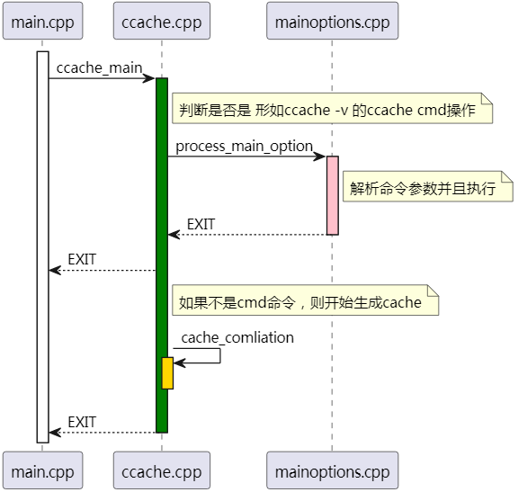
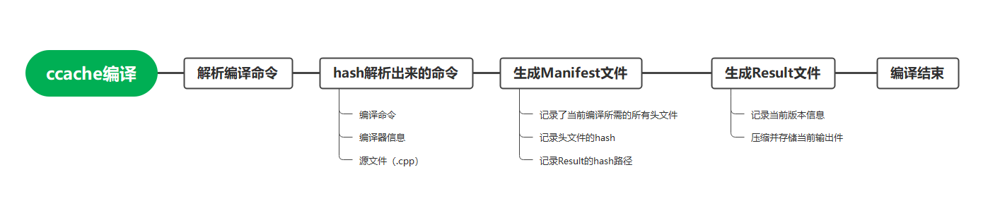

代码时序图
# CodeDetails
## main函数
ccache 首先对于当前输入参数进行解析，如果是ccache的命令行命令 形如
```
ccache -V // 显示ccache 版本
ccache -s // 显示统计信息
```
直接执行对应操作后退出。

而对于 `ccache g++ -c hello.c -o hello.o`等实际编译命令操作，则进行缓存操作处理。



ccache_compilation即实际缓存流程,先对整体流程有一个了解。

## 初始化
如果是编译命令
ccache先进行初始化操作，初始化内容有 读取配置文件、日志模块初始化、本地/远程仓库初始化以及找到实际编译器
> 找到实际编译是指，对于ccache的两种使用方式的 ccache g++ 以及ccache软链接形式的g++的转换，此时需要从环境变量中找到实际的g++编译器


## 生成manifest

初始化后，ccache对cwd、配置选项、命令输入参数、编译器、输入源文件(.cpp)...等进行hash。
最终得到一个hash值即manifest路径，并对其进行查询本地是否存在。


> 由于时序图仅标注重点流程，实际在获取Manifest的过程中还有一些本地、远程缓存保存细节。

如下流程图


## 直连命中

上述流程走到了从本地获取Manifest路径，此时返回有两种情况 获取/未获取到。

对于获取到Manifest文件,且本地仓库存在其result文件，其获取时序图如下


## 预处理命中